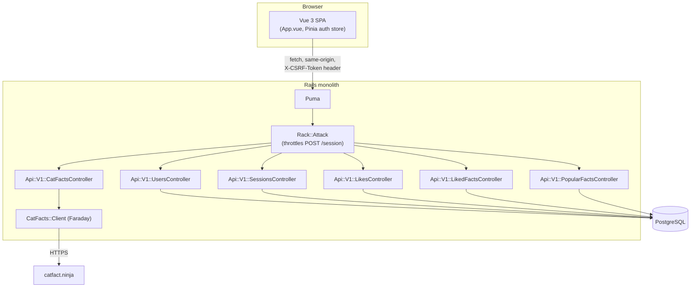
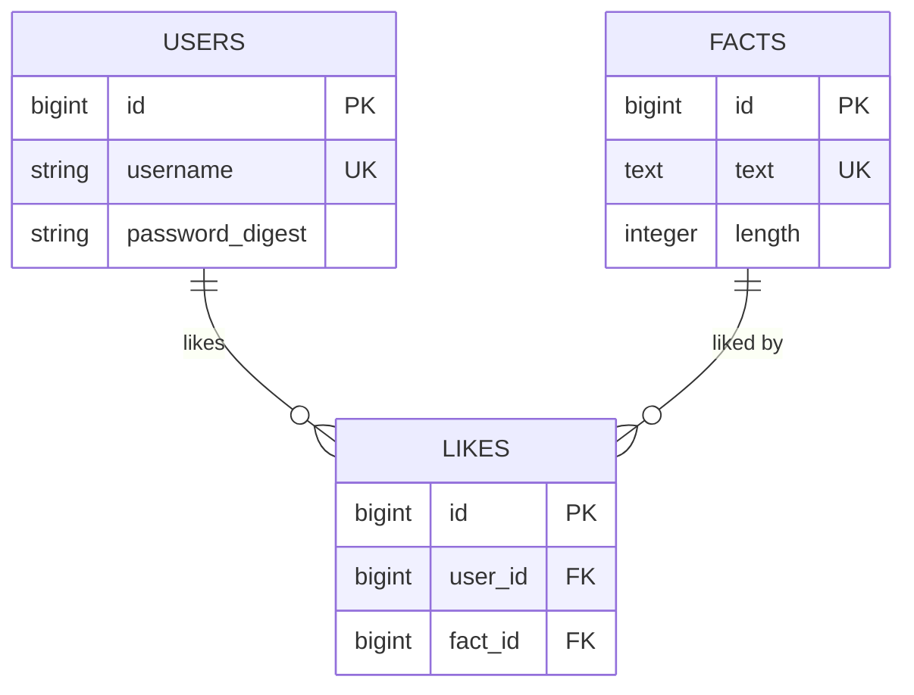
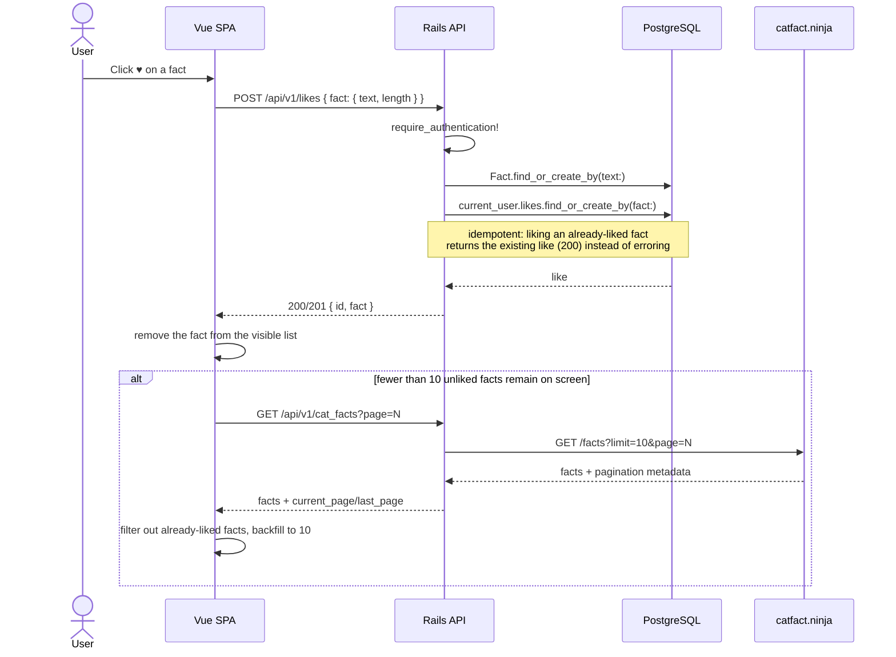
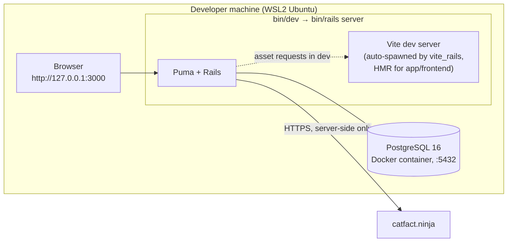

# SSCatFacts

A small web app where users register, log in, browse cat facts, like the ones
they enjoy, and see their own favorites and the community's most-liked facts.
Built as a technical assessment for SSINDEX.

## Tech stack

| Layer    | Choice                                                                 |
| -------- | ----------------------------------------------------------------------- |
| Backend  | Ruby 3.3.6, Rails 8.1 (monolith), PostgreSQL 16                         |
| Frontend | Vue 3 (Composition API), Pinia, Tailwind v4, integrated via `vite_rails`|
| HTTP client | Faraday (server-side calls to catfact.ninja)                         |
| Auth     | `has_secure_password` (bcrypt) + cookie session + CSRF token            |
| Rate limiting | rack-attack                                                         |
| Backend tests  | RSpec, FactoryBot, shoulda-matchers, WebMock                      |
| Frontend tests | Vitest, Vue Test Utils, @pinia/testing, happy-dom                 |
| Linters  | RuboCop (+ rails, performance), ESLint (flat config) + Prettier         |
| CI       | GitHub Actions: lint, security scan (Brakeman), backend & frontend tests|

## Architecture

Rails and Vue are deliberately decoupled: Rails only serves the HTML shell and
a JSON API under `/api/v1/*`; the Vue app is a single-page client that talks
to that API exclusively. This keeps the two layers independently testable and
would let the frontend be extracted into its own deployable later without
touching the backend.



The browser never talks to catfact.ninja directly — only `CatFacts::Client`
does, so the external dependency is fully mockable in tests (WebMock blocks
real network access) and swappable without touching the frontend.

## Data model

Likes are modeled as their own many-to-many join, not as a counter column on
`facts`. That's what lets a user un-like a fact, prevents double-liking (a
unique index on `[user_id, fact_id]`), and lets "popular facts" be a simple
`COUNT` over the join table instead of a value that has to be kept in sync by
hand.



`facts` rows are only created lazily, the first time someone likes a fact
fetched from catfact.ninja (`Fact.find_or_create_by(text:)`) — the API itself
is never mirrored wholesale into the database.

## Example flow: liking a fact



## API overview

All endpoints below live under `/api/v1` and require an authenticated session
except `POST /users` and `POST /session`.

| Method | Path             | Purpose                                              |
| ------ | ---------------- | ----------------------------------------------------- |
| POST   | `/users`         | Register (auto-logs in on success)                   |
| POST   | `/session`       | Log in (rate-limited: 5 attempts / 20s per IP)        |
| DELETE | `/session`       | Log out                                               |
| GET    | `/me`            | Current session's user                                |
| GET    | `/cat_facts`     | Paginated facts proxied from catfact.ninja            |
| POST   | `/likes`         | Like a fact (creates the fact row if new)             |
| DELETE | `/likes/:id`     | Un-like                                                |
| GET    | `/liked_facts`   | Current user's favorites, paginated                    |
| GET    | `/popular_facts` | Top 10 facts by like count                             |

## Deployment

There's no hosted deployment yet. The diagram below is the everyday local
setup (`bin/dev`, hot-reloading Vite); a self-contained `docker-compose`
alternative is also available and described further down. Both target the
same production-mode image the Dockerfile builds (`bundle exec bootsnap` +
`assets:precompile`), which can also run standalone via Kamal or plain
`docker run` — see the file's header comment.



### Running it via docker-compose

`docker-compose.yml` builds the production image (assets precompiled with
Vite/Node during the build, no dev server) and runs it against its own
Postgres container — a fully self-contained alternative to the rbenv/nvm/
Docker-for-Postgres-only setup above, useful for trying the app without
installing Ruby or Node at all:

```bash
docker compose up --build
```

This creates the primary database plus the `solid_cache`/`solid_queue`/
`solid_cable` support databases Rails 8 needs in production (all in the same
`db` container, via `bin/rails db:prepare` in the entrypoint), then serves
the app at **http://127.0.0.1:3000**.

By default it runs with a throwaway `SECRET_KEY_BASE` and `POSTGRES_PASSWORD`
baked into `docker-compose.yml` as fallbacks, fine for trying it out locally
but not for anything shared. Override either via a `.env` file next to
`docker-compose.yml` (already git-ignored) — both are read consistently by
every service that needs them, so changing the password here can't drift out
of sync with the database URLs:

```
SECRET_KEY_BASE=<output of bin/rails secret>
POSTGRES_PASSWORD=<a real password, not "postgres">
```

## Local development

This was built and tested on **WSL2 Ubuntu**; the instructions below assume
that but apply equally to native Linux/macOS.

### Prerequisites

- Ruby 3.3.6 (via [rbenv](https://github.com/rbenv/rbenv))
- Node 22 (via [nvm](https://github.com/nvm-sh/nvm))
- Docker, for PostgreSQL

```bash
docker run --name cat-facts-postgres -e POSTGRES_PASSWORD=postgres -p 5432:5432 -d postgres:16
```

### Setup

```bash
bundle install
npm install
bin/rails db:create db:migrate
```

`config/master.key` is **not** required for development or test — only for
production, and it's git-ignored on purpose (never commit it).

### Running the app

```bash
bin/dev   # or: make dev
```

`bin/dev` runs `bin/rails server`; `vite_rails`'s `autoBuild` setting
(`config/vite.json`) then spawns and manages the Vite dev server itself, so
this one command is enough — no separate Procfile runner needed. Open the app
at
**http://127.0.0.1:3000** — not `localhost`. On WSL2, IPv6 loopback
resolution for `localhost` can be flaky and breaks session cookies, since
they're scoped per-host.

### Checks

```bash
make check   # lint (RuboCop + ESLint) and test (RSpec + Vitest)
make lint
make test
make db-migrate
```

CI (`.github/workflows/ci.yml`) runs the same checks — lint-backend,
lint-frontend, a Brakeman security scan, and both test suites against a real
Postgres service — on every push to `main`/`develop` and every PR.

## Git workflow

- `main` (protected — release/hotfix only) ← `develop` (default) ← `feature/*`.
- Every change lands via PR, including solo work.
- [Conventional Commits](https://www.conventionalcommits.org/): `feat:`,
  `fix:`, `chore:`, `test:`, `ci:`, `docs:`, lowercase, imperative mood.
- Commits are kept atomic; fixups to a branch's own commits go through
  `git commit --fixup` + `git rebase -i --autosquash` +
  `git push --force-with-lease`, never a plain amend of pushed history.
- Releases: a `release/x.y.z` branch merges into `main` and gets tagged.

## Security notes

- Sessions are httpOnly cookies; the frontend never touches the session
  token directly.
- `protect_from_forgery` + a CSRF token read from `csrf_meta_tags` and sent
  as `X-CSRF-Token` on every mutating request (see `app/frontend/api/client.js`).
- `POST /api/v1/session` is throttled by IP via rack-attack (5 attempts per
  20s), returning `429` past the limit — independent of whether the guess was
  correct, so a valid password doesn't bypass the throttle.
- Tests never touch the real network: WebMock blocks it outright, and
  `CatFacts::Client` is the only thing that talks to catfact.ninja.
